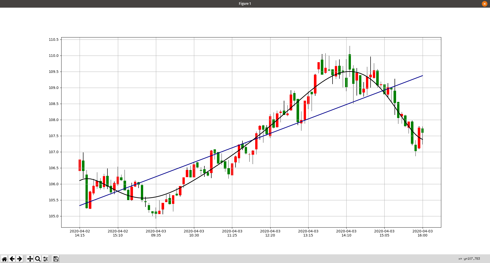

# AlphaVantage Finance
Simple Experimental Python project to download data from AlphaVantage API and run some simple sklearn Machine Learning Functions.

Requirements:
* Download data from Alpha Vantage API - Demo API Key
* Save downloaded data to local file
* Convert downloaded data to pandas.
* Generate candlestick chart manually using only plt.bar and plt.plot function. This is only to learn how matplotlib works and also play a little bit more with pandas. 
* Make sure that X-axis legend is not to dense. 
* Calculate polynomal and linear regressions. 
* Configure travis for python

