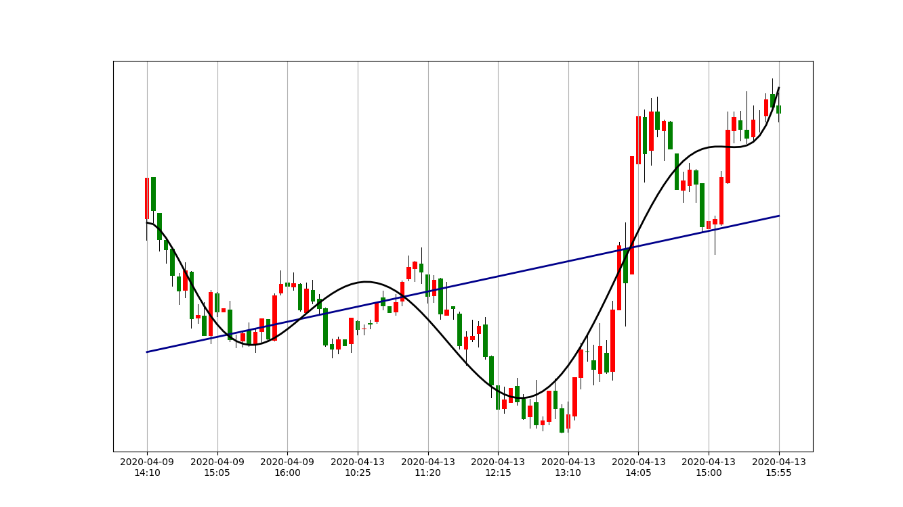

# AlphaVantage Finance
Simple Experimental Python project to download data from AlphaVantage API and run some simple sklearn Machine Learning Functions.

Requirements:

- [x] Download data from Alpha Vantage API - Demo API Key 
- [x] Save downloaded data to local file
- [x] Convert downloaded data to pandas.
- [x] Generate candlestick chart manually using only plt.bar and plt.plot function. This is only to learn how matplotlib works and also play a little bit more with pandas. 
- [x] Make sure that X-axis legend is not to dense. 
- [x] Calculate polynomal and linear regressions. 
- [x] Configure travis for python

